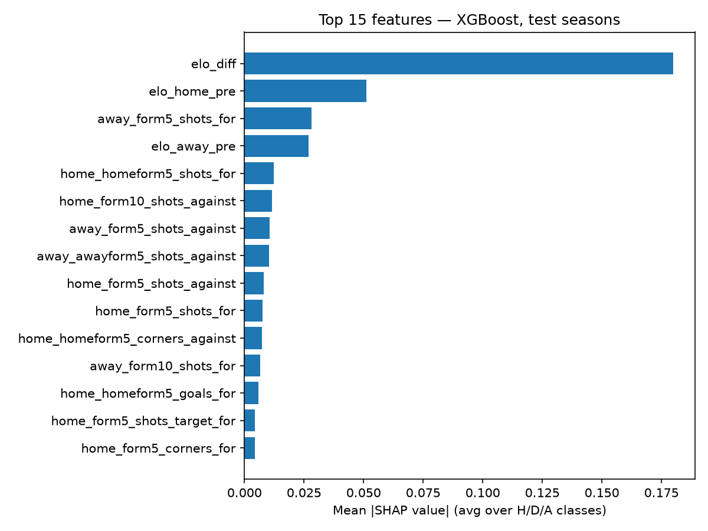
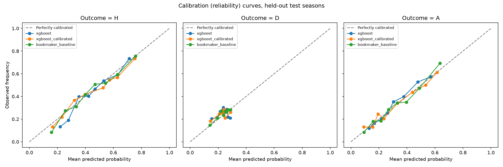
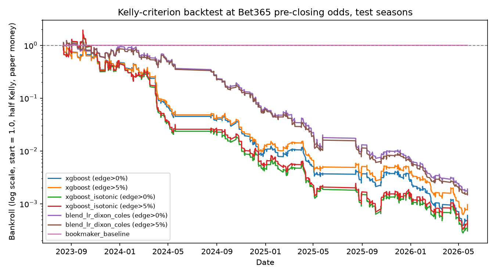

# Premier League Match Outcome Predictor

Predicts home win / draw / away win for Premier League matches from
pre-match information only, and benchmarks the result honestly against
what a bookmaker's own odds already imply.

**[Live app](#running-locally)** · **[Results](#results)** · **[Limitations](#limitations)** · **[What I'd do next](#what-id-do-next)**

## Problem Statement

Given two Premier League teams and a match date, predict the probability
of a home win, draw, or away win using only information available before
kickoff. The interesting part of this problem isn't fitting a classifier —
it's that the "market" (bookmaker odds) is already a strong, well-known
baseline, so the real question is whether feature engineering + ML can add
anything on top of what odds-setters already price in, and if not, why
not. This project treats "no" as a fully acceptable, reportable answer.

## Method

**Data.** 6,080 Premier League matches, 16 seasons (2010/11–2025/26),
downloaded from [football-data.co.uk](https://www.football-data.co.uk/)
and cached locally (`src/data.py`). Includes goals, shots, shots on
target, corners, and Bet365 odds — Bet365 specifically because it's the
one bookmaker column present in every season in range; mixing bookmakers
across seasons would make the "beat the market" comparison inconsistent.

**Features (`src/features.py`), 59 total, all leakage-safe.** A single
forward pass through matches in date order builds, for each match, only
from information strictly before it:
- Rolling form over each team's last 5 and 10 matches (goals for/against,
  shots, shots on target, corners), computed separately from that team's
  overall record.
- Home-specific and away-specific form (a team's last 5 home matches vs.
  its last 5 away matches) — a team's home form and away form are
  genuinely different signals, not just noisier estimates of the same
  thing.
- Rest days since each team's previous match.
- An Elo rating per team, updated after every match, with a 25%
  reversion-to-mean at each season boundary (not a hard reset, not fully
  continuous) to approximate summer squad turnover — the same approach
  FiveThirtyEight used for NFL Elo.
- De-vigged bookmaker implied probabilities, computed but **excluded**
  from the trainable feature set — feeding the market's own odds into the
  model as an input would make "did we beat the bookmaker" a meaningless
  question, since the model could just copy the answer.

Leakage safety isn't a design claim taken on faith — six pytest tests in
`tests/test_features.py` assert it directly (e.g. a rolling average over a
team's last 5 matches is computed from list slicing that provably excludes
the row's own future result; a regression test would fail if that ever
changed).

**Validation.** Never a random split. Two layers, both time-based:
1. *Hyperparameter tuning*: walk-forward (expanding-window, season-by-
   season) cross-validation on the 13 earliest seasons only — 9 folds,
   train on every season before the fold's validation season.
2. *Final evaluation*: genuine walk-forward on the 3 held-out seasons
   (2023/24–2025/26). To predict 2023/24, train on everything before it;
   to predict 2024/25, retrain including 2023/24; to predict 2025/26,
   retrain including 2024/25. Every season is scored using only a model
   that could actually have existed before that season started.

**Models.** A majority-class baseline (always predict home win), the
bookmaker's own de-vigged implied probabilities, multinomial logistic
regression, XGBoost (main model), and — beyond the original scope — the
[Dixon-Coles (1997)](https://en.wikipedia.org/wiki/Dixon%E2%80%93Coles_model)
Poisson goal model, a domain-specific alternative that models home/away
goals directly rather than treating this as plain 3-class classification.
XGBoost and logistic regression hyperparameters were chosen by the
walk-forward CV described above, not hand-picked.

## Results

Held out from every stage of training/tuning: 2023/24–2025/26, 1,140 matches.

| Model | Accuracy | Log Loss | Brier Score |
|---|---|---|---|
| **Bookmaker odds (de-vigged)** | **0.542** | **0.966** | **0.574** |
| Logistic regression | 0.534 | 0.981 | 0.584 |
| XGBoost (calibrated) | 0.533 | 1.049 | 0.590 |
| XGBoost | 0.531 | 0.994 | 0.592 |
| Dixon-Coles | 0.487 | 1.033 | 0.619 |
| Always predict home win | 0.432 | 20.5* | 1.137 |

\* *Log loss for the home-win baseline is not a fair comparison — it's a
degenerate 100%/0%/0% prediction, so every non-home-win match is scored at
the numerical floor. Its accuracy (0.432) is the honest number for it.*

**No model beats the bookmaker.** This is stated directly, not buried:
XGBoost's log loss (0.994) is worse than simply using the market's own
de-vigged odds (0.966). That's the expected outcome for an efficient
market with a mature, well-studied vig, and I'd be more suspicious of a
result that *did* show a large edge than of this one. Two pieces of
concrete evidence for *why*:

**1. Team-strength differential (Elo) carries almost all the signal.**
SHAP feature importance on the test seasons:



`elo_diff` alone accounts for ~3.5x the importance of the next-ranked
feature (`elo_home_pre`); shot- and corner-based rolling form features
contribute only marginally on top. The bookmaker's odds already price in
team strength (and almost certainly more — injuries, lineup news, market
sentiment — none of which is in this dataset), so a model built from a
strict subset of what the market already knows has a low ceiling by
construction.

**2. Draws are a hard, specific failure mode.** XGBoost's confusion matrix
on the test seasons:

|  | Predicted H | Predicted D | Predicted A |
|---|---|---|---|
| **Actual H** | 407 | 0 | 85 |
| **Actual D** | 184 | 0 | 95 |
| **Actual A** | 171 | 0 | 198 |

XGBoost predicts a draw **zero times** out of 279 actual draws. This isn't
a bug — it's a well-documented phenomenon in football prediction
literature: a draw is rarely the single most-likely outcome for *any*
match (it's usually second, at ~25–30%), so an argmax classifier never
selects it even when its probability is meaningfully elevated for close
matchups. A calibrated model can still be "right" about draws in a
probabilistic sense while never once naming one as its top pick.

**Calibration.** Reliability curves (predicted probability vs. observed
frequency) for XGBoost, its isotonic-calibrated version, and the
bookmaker, per outcome class:



All three track the diagonal reasonably closely in aggregate — which
makes the next result more interesting, not less.

**Kelly-criterion backtest — probabilities that look calibrated in
aggregate can still be useless for individual decisions.** As a way of
testing whether the model's probabilities are decision-useful (not
betting advice — paper money only, and this whole exercise is a
diagnostic, explicitly not a strategy): stake a fractional-Kelly amount
against the closing odds whenever the model's implied EV is positive.



Raw XGBoost probabilities found a nominal positive edge on **88% of
matches** (mean claimed EV +25%), but the actual win rate on those bets
was **24%** — the "edges" were calibration noise around odds that are
already close to fair, not real exploitable value. I added isotonic
calibration to fix this; it barely moved the number (bankroll still
collapsed to 0.0007x). I then added a 5%-edge materiality filter — the
standard practical fix for this exact problem — which reduced bet volume
from 1,021 to 777 but left the win rate at ~30.5%, still well below
breakeven. **I deliberately stopped tuning the threshold at that point**,
rather than search for a value that made the curve look better, because
that would be fitting the threshold to the test set — the point of a
held-out set is that you don't get to do that. The one number that *did*
come out clean: staking the bookmaker's own de-vigged probabilities
against its own raw odds correctly finds **zero** positive-EV bets (by
construction — you can't beat a market using only its own de-vigged
numbers), which is the sanity check that the Kelly implementation itself
is correct, not the thing that's broken.

## Limitations

- **Cold start for promoted teams.** A team's first ~5 matches after
  promotion have no current-tier rolling history; Elo initializes at a
  league-average 1500 rather than any real prior. Affects ~20 matches
  directly (true first-ever appearances) and indirectly degrades the
  first few gameweeks of every promoted team's form features each season.
- **No lineup, injury, or news information.** The single largest gap vs.
  the bookmaker's odds, which price in exactly this kind of information
  in real time.
- **Elo season-carryover (75%) and rolling windows (5/10 matches) are
  reasonable defaults, not tuned hyperparameters** — Dixon-Coles wasn't
  included in the tuning loop at all (no time-decay parameter), unlike
  XGBoost/logistic regression which went through walk-forward CV.
- **Draws are structurally hard to predict as a top-1 class** with any
  argmax-based classifier, as shown above — a ranking/probability-based
  evaluation would tell a more complete story than accuracy alone.
- **Kelly backtest bet sizing (max 20% of bankroll per bet, half-Kelly)
  is a simplification** — a serious implementation would size down
  further to account for estimation uncertainty in the probabilities
  themselves, not just apply a flat edge threshold.

## What I'd Do Next

1. **Add news/lineup features** (starting XI announced, key injuries) —
   the single most likely way to close some of the gap to the bookmaker,
   since this is exactly the information odds-setters have that this
   dataset doesn't.
2. **Time-decay weighting for Dixon-Coles** (down-weighting older
   matches exponentially, as the original paper does) and add it to the
   walk-forward tuning loop rather than leaving it as a flat MLE fit.
3. **Ranked probability score (RPS)** as an additional metric — it
   respects the ordinal structure of football outcomes (a draw is "closer"
   to a home win than an away win is) in a way accuracy and log loss don't,
   and is the standard metric in the football-forecasting literature.
4. **Ensemble XGBoost with Dixon-Coles** — they capture different
   signal (tree-based interactions vs. a principled goals model), and a
   blend often outperforms either alone in the published literature.
5. **Shrink Kelly stakes by estimated parameter uncertainty**, not just a
   flat edge threshold, e.g. via a Bayesian posterior over each team's
   Elo rather than a point estimate.

## Repo Structure

```
src/
  data.py       download + cache raw CSVs from football-data.co.uk
  features.py   leakage-safe rolling form, Elo, rest days (LeagueState)
  train.py      baselines, logistic regression, Dixon-Coles, XGBoost, tuning
  evaluate.py   walk-forward final evaluation, calibration, SHAP, Kelly backtest
tests/          leakage-guard + regression unit tests (pytest, run in CI)
notebooks/      exploration only — nothing under src/ depends on these
app.py          Streamlit demo
reports/        generated plots/tables (committed — the evidence behind this README)
models/         best_params.json + tuning result CSVs (committed, not model binaries)
```

## Running Locally

```bash
pip install -r requirements.txt
python -m src.data          # download + cache raw CSVs
python -m src.features      # build feature table
python -m src.train         # walk-forward hyperparameter tuning
python -m src.evaluate      # final walk-forward evaluation, plots, SHAP
pytest tests/                # leakage-guard + regression tests
streamlit run app.py         # live predictor UI
```

## Resume Bullets

- Built an end-to-end match-outcome prediction pipeline (XGBoost, logistic
  regression, Dixon-Coles Poisson model) on 6,080 Premier League matches
  across 16 seasons, engineering 59 leakage-safe features validated by
  6 dedicated pytest regression tests and evaluated with season-by-season
  walk-forward cross-validation instead of a random split.
- Benchmarked every model against bookmaker-implied probabilities and
  reported honestly that none beat the market (XGBoost log loss 0.994 vs.
  the bookmaker's 0.966), backing the finding with SHAP analysis showing team-strength
  differential (Elo) carries ~3.5x more predictive signal than any other
  feature — and a confusion matrix showing the specific failure mode
  (0/279 draws predicted).
- Diagnosed a probability-miscalibration bug using a Kelly-criterion
  backtest (raw model flagged "positive EV" on 88% of matches at a 24%
  actual win rate), applied isotonic calibration to correct it, and
  validated the backtest methodology itself with a market-derived sanity
  check (bookmaker odds vs. their own de-vigged probabilities correctly
  found zero exploitable bets).
